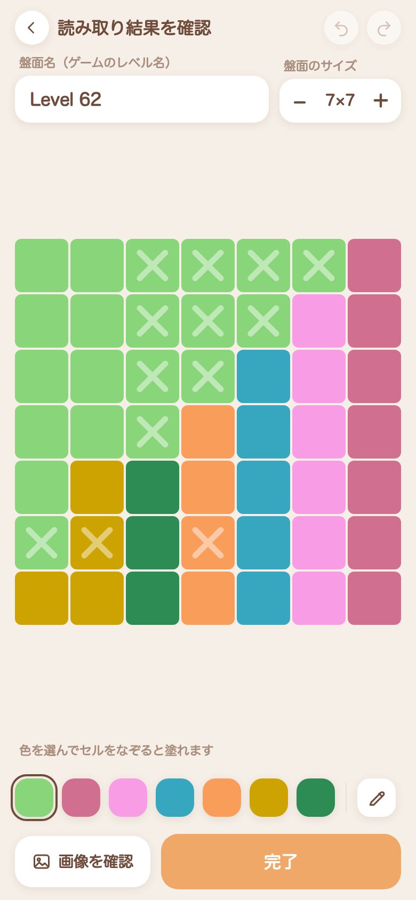

# Memodoku

Meowdoku（ネコのクイーンズ系パズル）を解くときの、思考メモ専用ツールです。
ゲーム内では置けない量のバツを自由に置いて、仮定を試すために使います。

**https://memodoku.sanchezy.space**

<p>
  
  
  
</p>

## できること

- **スクショから盤面を起こす** — ゲームのスクリーンショットを渡すと、色の領域・盤面サイズ・レベル名を読み取って、まっさらなメモ盤面を作ります。写っている猫とバツも取り込めて、表示のオン・オフを切り替えられます
- **メモを何枚でも重ねる** — 1つの盤面に対してメモを複数持てます。下のスクラバーで切り替えられるので、仮定ごとに分けて試せます
- **リンクで共有** — 盤面とメモをまるごと URL に載せて渡せます。受け取った側はそのまま開いて、自分のメモとして保存できます
- **ブラウザの中だけで動く** — サーバーもアカウントもありません。スクリーンショットはどこにも送られず、端末の中だけで処理されます

## 使い方

1. Meowdoku の盤面のスクリーンショットを撮る
2. サイトを開いて「スクショから盤面を読み込み」
3. 読み取り結果を確認して「完了」
4. タップでバツ、もう一度タップで猫。ドラッグでまとめて塗れます

ホーム画面に追加すると、アプリとして起動できます（PWA）。

メモはブラウザの中だけに保存されます。別の端末やブラウザからは見られないので、持っていくときは共有リンクを使ってください。

## 開発

```bash
npm install
npm run dev      # 開発サーバ
npm test         # ユニットテスト（実機スクショを使った画像解析の検証を含む）
npm run lint
npm run build    # 静的ビルド（dist/）
```

`npm run dev` は自己署名証明書の https で立ち上がります（クリップボードの読み取りなどが
セキュアコンテキストを必要とするため）。証明書の警告が邪魔なときは `npm run dev:http` で
平文の開発サーバに落とせます。

`main` に push すると GitHub Actions がビルドして GitHub Pages に配信します。

内部の作りは [AGENTS.md](AGENTS.md)、仕様は [docs/spec.md](docs/spec.md) にあります。
