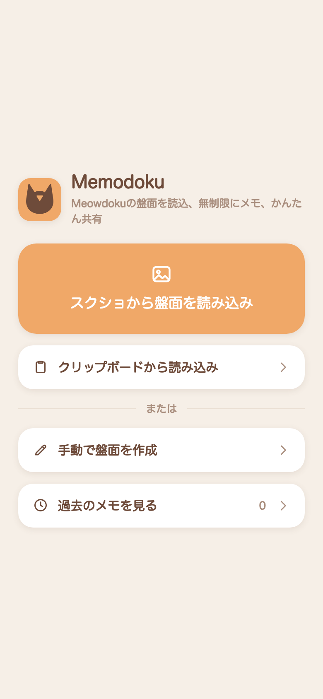
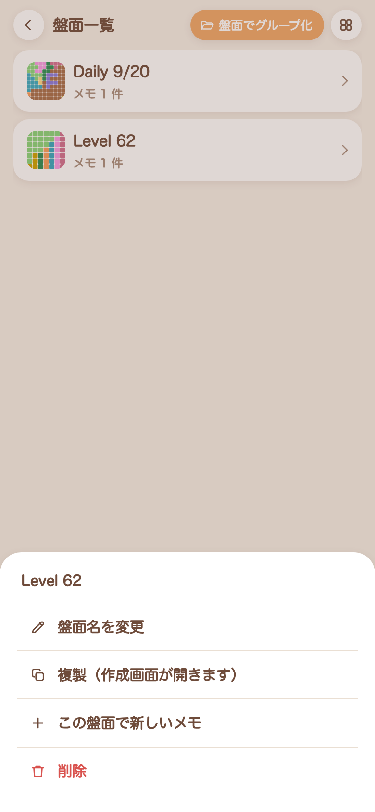
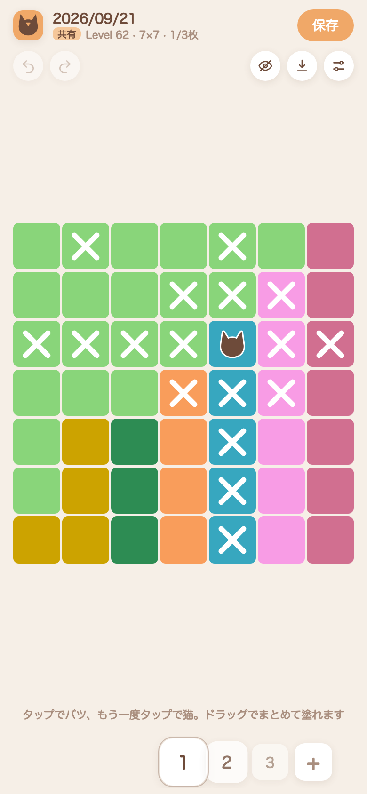

# Memodoku

スマホパズルゲーム、Meowdokuを解くときの、思考メモ専用ツール。
長い広告を見なくても無限の仮定を試せます。

**https://memodoku.sanchezy.space**

<p>
  
  
  
</p>

## 特徴

- スクショから盤面を読み込み、処理はブラウザで完結
- 同じ盤面に何枚もメモして比較
- サーバーレスに過去の盤面を保存
- 画像をエクスポートしたり、編集可能な画面をリンクで共有
- PWA対応


## 使い方

1. Meowdoku の盤面のスクリーンショットを撮る
2. Memodokuを開いて「スクショから盤面を読み込み」
3. 読み取り結果を確認して「完了」

4. Meowdokuと同じ体験で、広告なしで無限にメモ

ホーム画面に追加すると、PWAアプリとして起動できます。

メモはブラウザの中だけに保存されます。
## 開発

```bash
npm install
npm run dev      # 開発サーバ
npm test         # ユニットテスト（実機スクショを使った画像解析の検証を含む）
npm run lint
npm run build    # 静的ビルド（dist/）
```

`npm run dev` は自己署名証明書の https で立ち上がります（クリップボードの読み取りなどが
セキュアコンテキストを必要とするため）。証明書の警告が邪魔なときは `npm run dev:http` でhttpの開発サーバを起動できます。

## ライセンス

GPL-3.0-or-later。`test/fixtures/shots/` と `docs/screenshots/` の画像は Meowdoku の著作物なので、対象外です。
